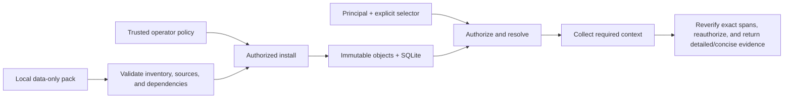

<div align="center">


# StandardsForge

**Turn MIL-STD evidence into stronger products, requirements, and test plans.**

StandardsForge helps teams building physical products gather the military standards that may shape their design, retrieve the exact source evidence, and use it to develop requirements, test plans, and a standards-aware product roadmap.<br>
It is an offline-first compiler and evidence engine: every result stays tied to the source, edition, governing conditions, and known evidence limits.

[](pyproject.toml)
[](pyproject.toml)
[](LICENSE)
[](docs/PRD.md)

[](docs/ARCHITECTURE.md)
[](#connect-a-local-mcp-host)
[](docs/ARCHITECTURE.md)
[](pyproject.toml)

**Topics:** [defense-engineering](https://github.com/topics/defense-engineering) · [military-standards](https://github.com/topics/military-standards) · [mil-std](https://github.com/topics/mil-std) · [systems-engineering](https://github.com/topics/systems-engineering) · [requirements-engineering](https://github.com/topics/requirements-engineering) · [mcp](https://github.com/topics/mcp) · [offline-first](https://github.com/topics/offline-first)

[Quickstart](#query-the-prebuilt-corpus) · [Commands](#seven-ways-to-read) · [Architecture](#under-the-hood) · [Roadmap](#where-this-is-going) · [Contributing](CONTRIBUTING.md)

</div>

---

## From physical product to defensible plan

Physical products are shaped by more than a list of standard numbers. Teams need to know which editions they are evaluating, what the source actually says, which conditions and exceptions travel with a requirement, and where that evidence affects the design and verification strategy.

StandardsForge provides the evidence backbone for that work:

- **Gather authorized MIL-STD sources locally.** Preserve the publisher identity, exact edition, notices, component files, and source hashes instead of building from an untraceable document folder.
- **Discover standards evidence relevant to the product.** Search an authorized local corpus, resolve the intended edition and representation, and pin the exact package used for the engineering baseline.
- **Build traceable requirements and test plans.** Retrieve exact clauses with their governing notes, conditions, exceptions, citations, and declared dependencies so engineers can turn evidence into design inputs and verification work.
- **Harden the product roadmap.** Use source-linked evidence to expose missing decisions, qualification work, test assets, design changes, and review gates before they become late-program surprises.

For example, a technical standard may require a connector to withstand **80 N for 60 seconds**, while a governing note requires **two hours at 23 °C ± 2 °C** first. Retrieving only the clause produces an incomplete test basis. StandardsForge follows the pack's declared dependencies and returns both with exact source text, locations, and hashes.

The engine supplies evidence, not engineering approval. It does not decide whether a standard applies to a specific product, approve a requirement or test plan, or certify compliance. Those decisions stay with the responsible engineering and program authorities; StandardsForge makes their source basis explicit and reviewable.

## Query the prebuilt corpus

The prepared StandardsForge release is already compiled for use. It contains the complete public DLA MIL-STD corpus in verified compressed packs, plus a model-ready MIL-STD-810H derived outline. You do **not** need to download hundreds of PDFs or compile standards before searching them.

The current prepared baseline contains:

- **438** compiled MIL-STD page-text packs from **912** verified source PDFs.
- **35,218** source-linked page records across **35,235** physical pages.
- About **1.0 GB** of deterministic compressed packs.
- A one-command local setup that validates and indexes the included packs for offline queries.

Download and extract [standardsforge-ready-0.1.0a2.zip](https://github.com/DDNA-Engineering/standards-memory/releases/download/v0.1.0a2/standardsforge-ready-0.1.0a2.zip), and optionally verify its [published SHA-256 checksum](https://github.com/DDNA-Engineering/standards-memory/releases/download/v0.1.0a2/standardsforge-ready-0.1.0a2.zip.sha256). You need **Python 3.11+** with SQLite FTS5 support. Open **PowerShell** in the extracted directory and run:

```powershell
# Create the isolated local environment and index the included compiled packs.
.\setup.ps1

# Search the installed MIL-STD corpus.
.\standardsforge.ps1 search "environmental testing" --principal local-user --limit 5

# Resolve the prepared MIL-STD-810H representation and capture its immutable package pin.
$resolved = .\standardsforge.ps1 resolve 'MIL-STD-810H(1)' --representation derived_structure --principal local-user | ConvertFrom-Json
$pin = $resolved.result.package_digest

# Search only that pinned edition and representation.
.\standardsforge.ps1 search "low pressure" --package-digest $pin --principal local-user --limit 5
```

The one-time setup installs only the bundled wheel and precompiled packs; it does not fetch standards or call a model. Commands return source-linked JSON with package identity, exact citations, coverage, and interpretation limits. Local state stays inside the extracted distribution.

The source repository also supports an optional MCP adapter for local model hosts:

```powershell
python -m pip install -e ".[mcp]"
standardsforge-mcp --db .standardsforge/memory.db --store .standardsforge/objects --principal local-user
```

The host owns the MCP process, so the final command intentionally stays running when launched directly.

> **Distribution boundary:** `.standardsforge/` remains excluded from the source-only Git repository because it is machine-local runtime state. The prepared release asset carries the verified precompiled public corpus separately. A plain Git clone contains the compiler and example packs; end users should use the prepared release. The rebuild workflow below is for maintainers creating or refreshing that release.

<details>
<summary><strong>Try the small fictional example instead</strong></summary>

```powershell
python -m standardsforge verify-pack examples/packs/fictional-adapter-v1
python -m standardsforge install examples/packs/fictional-adapter-v1 --policy examples/policies/local-synthetic.json
$example = python -m standardsforge resolve EXAMPLE-SPEC-100 --edition example:spec-100:2025-a --representation curated_records --principal local-user | ConvertFrom-Json
python -m standardsforge get-clause $example.result.package_digest 4.2.1 --principal local-user
```

This returns the connector-retention clause with its governing conditioning note and is useful for development without the prepared corpus.

</details>

## Rebuild or refresh the official-source corpus

This is a maintainer workflow, not a prerequisite for using a prepared StandardsForge distribution. Run it only when creating the corpus from authoritative publisher files or refreshing it against a newly approved source baseline.

Source acquisition writes to ignored local state. The repository tracks provenance and integrity metadata rather than committing third-party PDFs.

The first compiler seed catalog contains the current DLA ASSIST editions of MIL-STD-961, MIL-STD-962, and MIL-STD-967—the format authorities for specifications, standards, and handbooks. A separate catalog pins MIL-STD-810 Revision H Change 1 for environmental-engineering compilation and qualification. Catalog inclusion is not a declaration that a standard applies to a particular product.

Use [DLA ASSIST Quick Search](https://quicksearch.dla.mil/) as the authoritative source. To acquire every current publicly exposed component of every active `MIL-STD-` record, run the resumable administrative downloader and then close the local files against its manifest:

```powershell
python -m standardsforge acquire-mil-std
python -m standardsforge verify-mil-std-acquisition `
  .standardsforge/sources/dla/mil-std/manifest.json
```

The acquisition scope is explicit: active records only; leading notices plus the first substantive current revision or incorporated change; Distribution Statement A files only. Restricted components remain inventory metadata and are not requested. Each completed PDF is signature-checked, hashed during transfer, atomically installed, and checkpointed for restart. Use `--inventory-only` to enumerate without downloading and `--reuse-inventory` to resume from a completed inventory snapshot.

For the smaller tracked seed catalogs, place each file at the exact name declared by its catalog and verify the sets locally:

```powershell
python -m standardsforge verify-source-set catalog/mil-format-authorities.json `
  --source-root .standardsforge/sources/dla/format-authorities

python -m standardsforge verify-source-set catalog/mil-std-810h.json `
  --source-root .standardsforge/sources/dla/mil-std-810h
```

Verification is offline and closed-set: every declared file must be present, no unexpected directory entries are accepted, and the PDF signature, byte length, and SHA-256 digest must match. Page counts are recorded publisher/source metadata and are not recomputed by this command.

EverySpec is useful for discovery, but its [published terms](https://everyspec.com/terms_of_use.php) prohibit automated downloading and processing. StandardsForge therefore does not scrape it. Bulk acquisition is an explicit administrative action against the official DLA publisher source, separate from every read operation; query tools never fetch URLs.

## Compile verified source material

Install the separately pinned compiler dependency, then compile a catalog-pinned source into an installable local pack:

```powershell
python -m pip install -e ".[compiler]"
python -m standardsforge compile-pdf catalog/mil-std-810h.json MIL-STD-810 `
  .standardsforge/compiled/mil-std-810h `
  --source-root .standardsforge/sources/dla/mil-std-810h
```

Create a deterministic compressed transport without changing the package digest:

```powershell
python -m standardsforge archive-pack .standardsforge/compiled/mil-std-810h .standardsforge/compiled/mil-std-810h.zip
```

To compile every verified downloaded DLA current component, keep notices and revisions together by DLA record, create an explicit exact-pack local policy, and install the completed corpus:

```powershell
python -m standardsforge compile-mil-std-corpus `
  .standardsforge/sources/dla/mil-std/manifest.json `
  .standardsforge/corpus/mil-std-current `
  --source-root .standardsforge/sources/dla/mil-std
python -m standardsforge write-corpus-policy `
  .standardsforge/corpus/mil-std-current/corpus.json `
  .standardsforge/policies/mil-std-corpus-local.json `
  --principal local-user
python -m standardsforge install-corpus `
  .standardsforge/corpus/mil-std-current/corpus.json `
  --policy .standardsforge/policies/mil-std-corpus-local.json
```

Corpus compilation is restartable and matches the complete ordered composition plus compiler provenance before reusing an archive. One pack represents one ordered DLA current-component set; only Distribution Statement A components may be compiled, records with both public and restricted components remain explicitly partial, and restricted-only records produce no evidence pack. The corpus compiler accepts only empty-password public encryption, namespaces every page by DLA component, and reports pages with malformed or absent text layers instead of inventing OCR or silently calling the edition fully parsed. Reinstallation revokes obsolete active grants for prior generated versions of the same corpus pack identities.

The compiler preserves the original PDF, creates a separately hashed text sidecar, emits a page record for each extractable physical page, and writes a page-level extraction report. It does not silently run OCR, infer clause boundaries, interpret tables or figures, or classify obligations. Every page record remains `unclassified` and `unreviewed` until later compiler stages add evidence-backed structure and review.

`compile-structure` accepts a separate, edition-bound reviewed-annotation document. It emits stable logical node identities and typed relationships whose node and relationship claims are bound to exact physical-page UTF-8 spans. The shipped acceptance slice covers MIL-STD-810H Method 500.6 section 2.2.2 only and remains explicitly incomplete outside that reviewed scope.

To create navigable, explicitly unreviewed structure from any verified page-text pack or archive, run:

```powershell
python -m standardsforge compile-derived-outline <page-pack-or-archive> <output-directory>
```

The resulting `derived_structure` pack recognizes bounded headings, list items, notes, and table/figure captions while retaining exact source spans. Numeric table rows, repeated table footnotes, repeated method headers, unmatched prefixes, and unparsed pages are retained as unsupported regions. These records are candidates only: they remain `unclassified` and `automated_unreviewed`, produce no confirmed obligations, and make no table-cell, figure-visual, OCR, applicability, or compliance claim.

## Rebuild a model-ready MIL-STD-810H representation

The prepared workspace already contains this representation. Maintainers can use the following reproducible workflow to rebuild it from the completed corpus index, explicitly authorize exactly that output, install it, resolve its immutable pin, search it, and retrieve exact evidence. Run it from the repository root. The output and policy paths must not already exist.

```powershell
# Create an isolated environment and install the CLI, compiler, and MCP adapter.
py -3 -m venv .venv
$Python = Join-Path $PWD '.venv\Scripts\python.exe'
& $Python -m pip install --upgrade pip
& $Python -m pip install -e '.[compiler,mcp]'

# Select MIL-STD-810H from the already compiled downloaded corpus.
$CorpusIndex = Join-Path $PWD '.standardsforge\corpus\mil-std-current\corpus.json'
$Corpus = Get-Content -LiteralPath $CorpusIndex -Raw | ConvertFrom-Json
$Entry = $Corpus.entries | Where-Object { $_.document_id -eq 'MIL-STD-810H(1)' }
if (@($Entry).Count -ne 1) { throw 'Expected exactly one MIL-STD-810H(1) corpus entry.' }
$PagePack = Join-Path (Split-Path -Parent $CorpusIndex) $Entry.archive_path

# Compile a separate automated, unreviewed navigation representation.
$OutlinePack = Join-Path $PWD '.standardsforge\compiled\mil-std-810h-derived-outline'
& $Python -m standardsforge verify-pack $PagePack
& $Python -m standardsforge compile-derived-outline $PagePack $OutlinePack

# Explicitly authorize this exact validated pack and expected content class.
$Policy = Join-Path $PWD '.standardsforge\policies\mil-std-810h-derived-outline-local.json'
& $Python -m standardsforge write-pack-policy $OutlinePack $Policy `
  --principal local-user `
  --content-class public_government_standard
& $Python -m standardsforge install $OutlinePack --policy $Policy

# Resolve one representation, discover a candidate, then retrieve exact evidence.
$Resolved = & $Python -m standardsforge resolve 'MIL-STD-810H(1)' `
  --representation derived_structure `
  --principal local-user | ConvertFrom-Json
$Pin = $Resolved.result.package_digest
$Search = & $Python -m standardsforge search 'low pressure' `
  --package-digest $Pin `
  --principal local-user `
  --limit 3 | ConvertFrom-Json
$Hit = $Search.result.results | Select-Object -First 1
if ($null -eq $Hit) { throw 'Search returned no evidence candidate.' }
$ClauseReference = $Hit.clause_reference
$RecordId = $Hit.record_id
& $Python -m standardsforge get-clause $Pin $ClauseReference `
  --record-id $RecordId `
  --principal local-user `
  --response-profile concise_evidence_v1

# Start the read-only model tool server; this process intentionally stays running.
$Mcp = Join-Path $PWD '.venv\Scripts\standardsforge-mcp.exe'
& $Mcp --db .standardsforge/memory.db `
  --store .standardsforge/objects `
  --principal local-user `
  --result-mode structured_only
```

`write-pack-policy` does not silently trust a rights claim. The operator must name the expected content class, the validated pack must match it, and the resulting policy authorizes only that pack ID for the named principal.

## Seven ways to read

| Command | The job |
| --- | --- |
| `search` | Discover relevant records through authorized lexical search, source-linked snippets, and available heading ancestry. |
| `list-documents` | Inventory authorized installed packages by optional normalized identifier prefix, with signed pagination. |
| `resolve` | Turn an exact document identifier, edition, and optional representation into a package pin. |
| `get-clause` | Retrieve a uniquely referenced clause, note, or compiled page and its required dependency context. |
| `build-context` | Assemble multiple clauses without duplicating shared evidence. |
| `enumerate-obligations` | Traverse every explicitly classified obligation in a selected scope, with pagination. |
| `diff-editions` | Compare records by exact identity and surface changes in their dependency context. |

Pack validation (`verify-pack`) and administration (`install`, `revoke`) are separate from those seven read operations. Source-set verification is also administrative; it does not install, parse, or authorize a document.

## Connect a local MCP host

The core remains dependency-free. Install the separately pinned MCP adapter dependency when you need the local server:

```powershell
python -m pip install -e ".[mcp]"
```

Configure the MCP host to launch this stdio process against the database and object store populated by the administrative CLI:

```powershell
standardsforge-mcp --db .standardsforge/memory.db --store .standardsforge/objects --principal local-user
```

The host owns the process and talks over stdin/stdout, so the command intentionally blocks when run directly. It exposes exactly `search`, `list_documents`, `resolve_document`, `get_clause`, `build_context`, `enumerate_obligations`, and `diff_editions`. It has no install, pack-verification, revocation, HTTP, or caller-selected-principal surface. The trusted startup principal is bound to every call, core authorization is rechecked, and the SDK telemetry middleware is removed before serving.

Successful calls carry the CLI's `{ok,result}` envelope as structured content. Anticipated domain failures are MCP error results whose text is a typed `{ok:false,error}` JSON envelope.

During MCP initialization the server gives the host a MIL-STD reading workflow, and every tool description states its interpretation boundary. Models are told to resolve exact editions and representations, pin package digests, treat search as discovery, retrieve exact evidence and governing context, distinguish tailoring from applicability, and avoid treating zero classified obligations as proof of zero requirements. See the [model reading guide](docs/MODEL_READING_GUIDE.md).

## What stays attached to the evidence

- **The exact edition.** Edition IDs describe technical editions; package digests pin inventoried content bytes. Installing a newer edition leaves existing pins intact.
- **The exact representation.** Page text, automated derived structure, reviewed structure, and curated records can coexist for one edition. Resolution reports ambiguity or accepts an explicit representation; evidence reads use the selected package digest.
- **The governing context.** Required dependencies travel with a clause. A byte budget that cannot hold the required packet produces an error instead of silently dropping evidence.
- **The original source.** Stored source hashes and exact quoted text are checked when evidence is served.
- **The access decision.** Trusted local policy authorizes access, and queries recheck it. Rights claims inside an imported pack are provenance, not permission.
- **The distinction between evidence and judgment.** Source text, derived classifications, automated checks, and human approval remain separate. Retrieved evidence does not decide applicability or certify compliance.

Exhaustive traversal follows the obligations explicitly classified in the installed pack. Its coverage depends on that pack's records and declared scope; a search result is not a completeness claim.

## Under the hood



The core is a small Python library backed by SQLite and FTS5. Packs contain data and preserved sources. Query paths operate locally, with no network calls, model calls, URL fetching, or pack execution.

<details>
<summary><strong>A quick tour of the code</strong></summary>

| Module | Responsibility |
| --- | --- |
| `pack` | Validate inventories, content, citations, and dependencies. |
| `policy` | Parse trusted operator policy and authorize installation. |
| `store` | Maintain snapshots, grants, records, and lexical indexes. |
| `service` | Provide the seven read operations and signed, policy-bound continuations. |
| `cli` | Expose read operations and separate administrative commands. |
| `mcp_server` | Expose only the seven reads over local stdio under a startup-bound principal. |
| `source_catalog` | Validate official-source metadata and verify a closed local PDF set offline. |
| `compiler` | Compile a verified text-layer PDF into a raw-source-preserving, page-indexed pack. |
| `corpus_compiler` | Compile a verified acquisition manifest into restartable record-scoped archives and install them under exact local policy. |
| `outline_compiler` | Derive exact-span unreviewed navigation candidates and explicit unsupported regions from page records. |
| `structure_compiler` | Compile reviewed structural annotations into stable, source-spanned nodes and relationships. |
| `query_cache` | Keep bounded versioned closure/search projections without caching authorization or source verification. |

Start with [the architecture](docs/ARCHITECTURE.md) or browse [the source](src/standardsforge/).

</details>

## Where this is going

The larger goal is a **standards compiler and evidence engine**: turn authorized technical documents into portable packs, then return the smallest sufficient evidence for a task.

| Stage | Scope | Status |
| --- | --- | --- |
| M0 · Foundations | Contracts, identities, and rights boundaries | Local pack subset implemented; broader decisions remain proposed |
| M1 · Local evidence engine | Pack installation, pinned retrieval, all seven read operations | Implemented and locally qualified |
| M1.5 · Official source boundary | Tracked official metadata and offline local PDF integrity verification | Implemented for public-source local acquisition |
| M2 · Compilation | Raw-PDF preservation, page text, automated outlines, and reviewed source-spanned structure | Implemented; document-wide review remains incomplete |
| M3 · Identification and reading | Honest coverage, concise evidence, batched retrieval, caches, and source-linked scoped search | Implemented; derived nodes remain unreviewed candidates |
| M4 · Model access and onboarding | Principal-bound stdio MCP, model-facing MIL-STD guidance, and copy-paste local setup | Implemented; additional host adapters remain optional |

Full visual fidelity, table-cell and figure-visual interpretation, reviewed document-wide clause segmentation, and obligation classification have not been established. A hosted multi-tenant service is not a product target. See the [validation report](VALIDATION_REPORT.md) for recorded checks and limits, and the [backlog](backlog/tasks.json) for acceptance criteria.

## Work on it

Run the existing checks from the repository root:

```powershell
$env:PYTHONPATH = Join-Path $PWD 'src'
python -m pip install -e ".[mcp,compiler]"
python scripts/validate_contracts.py
python -m unittest discover -s tests -v
```

The suite covers pack and source integrity, policy and revocation boundaries, all read operations, MCP in-memory and stdio paths, deterministic PDF/corpus/outline compilation, representation selection, response profiles and budgets, caches, database snapshots, migrations, and negative cases. Real PDFs and generated packs remain ignored local inputs.

Build the prepared release only from the completed local corpus and qualified outline:

```powershell
python -m pip wheel . --no-deps --wheel-dir build/prepared-wheel
python scripts/build_prepared_distribution.py `
  --corpus-index .standardsforge/corpus/mil-std-current/corpus.json `
  --outline-pack .standardsforge/compiled/mil-std-810h-derived-outline `
  --wheel build/prepared-wheel/standardsforge-0.1.0a2-py3-none-any.whl `
  --output build/standardsforge-ready-0.1.0a2.zip `
  --version 0.1.0a2
```

The builder rejects incomplete corpora, missing or changed archives, duplicate pack identities, and policies that do not exactly authorize the public compiled pack set. It emits the release ZIP plus a SHA-256 checksum file.

Before contributing, read [CONTRIBUTING.md](CONTRIBUTING.md). Bring synthetic or demonstrably redistributable fixtures, and keep source facts distinct from interpretations.

| Looking for… | Start here |
| --- | --- |
| Project orientation | [Start here](START_HERE.md) |
| Product goals and invariants | [Product baseline](docs/PRD.md) |
| Design and decisions | [Architecture](docs/ARCHITECTURE.md) · [Decision index](docs/adr/README.md) |
| Pack and query contracts | [Contracts](contracts/README.md) |
| Release ownership and content permissions | [Governance](GOVERNANCE.md) |
| Reporting a vulnerability | [Security policy](SECURITY.md) |

## License

Code is licensed under [Apache 2.0](LICENSE). Standards content has separate permissions; the code license does not grant rights to third-party documents.
