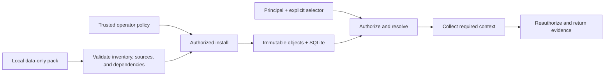

<div align="center">

# StandardsForge

**Engineering standards. Built into better products.**

An offline-first standards compiler and evidence engine.<br>
Give engineering teams traceable requirements for building robust, reliable products.


[](LICENSE)


[Quickstart](#try-it-locally) · [Commands](#six-ways-to-read) · [Architecture](#under-the-hood) · [Roadmap](#where-this-is-going) · [Contributing](CONTRIBUTING.md)

</div>

---

## Build on the right standards

Robust products start with understanding the standards they must meet: the right edition, the requirements, and the conditions under which those requirements apply.

For example, a technical standard requires a connector to withstand **80 N for 60 seconds**. A governing note says the assembly must first spend **two hours at 23 °C ± 2 °C**. Retrieve the clause alone and you've lost part of the test.

StandardsForge follows the pack's declared dependencies and returns both, with exact source text, locations, and hashes. Pin the package once and keep that evidence tied to the same bytes, even when another edition arrives.

StandardsForge gives engineers and their tools source-linked requirements they can use in design and verification, with the edition, governing conditions, and evidence limits visible.

## Try it locally

You need **Python 3.11+** with SQLite FTS5 support. The core has **no third-party runtime dependencies**. From a local checkout, run these commands in **PowerShell**:

```powershell
# Point Python at the source tree.
$env:PYTHONPATH = Join-Path $PWD 'src'

# Check the fictional pack, then install it using the example local policy.
python -m standardsforge verify-pack examples/packs/fictional-adapter-v1
python -m standardsforge install examples/packs/fictional-adapter-v1 --policy examples/policies/local-synthetic.json

# Resolve an exact edition and capture its immutable package pin.
$resolved = python -m standardsforge resolve EXAMPLE-SPEC-100 --edition example:spec-100:2025-a --principal local-user | ConvertFrom-Json
$pin = $resolved.result.package_digest

# Retrieve the clause together with its governing note.
python -m standardsforge get-clause $pin 4.2.1 --principal local-user
```

The last command returns a JSON evidence packet containing the connector-retention clause, its conditioning note, source references, and completeness metadata. Local state lives in `.standardsforge/`; use `--db` and `--store` before the command to choose another location.

**Keep exploring:**

```powershell
# Find relevant text in packs this principal can access.
python -m standardsforge search "connector" --principal local-user

# Assemble two clauses, including their required context.
python -m standardsforge build-context $pin 4.2.1 4.2.2 --principal local-user

# Walk every explicitly classified obligation in section 4.2.
python -m standardsforge enumerate-obligations $pin --scope 4.2 --principal local-user
```

Commands emit JSON. Application failures return a typed `error.code` and a nonzero exit status. See `python -m standardsforge --help` for all arguments.

## Six ways to read

| Command | The job |
| --- | --- |
| `search` | Discover relevant records through authorized lexical search. |
| `resolve` | Turn an exact document identifier and edition into a package pin. |
| `get-clause` | Retrieve a clause and its required dependency context. |
| `build-context` | Assemble multiple clauses without duplicating shared evidence. |
| `enumerate-obligations` | Traverse every explicitly classified obligation in a selected scope, with pagination. |
| `diff-editions` | Compare records by exact identity and surface changes in their dependency context. |

Pack validation (`verify-pack`) and administration (`install`, `revoke`) are separate from those six read operations.

## Connect a local MCP host

The core remains dependency-free. Install the separately pinned MCP adapter dependency when you need the local server:

```powershell
python -m pip install -e ".[mcp]"
```

Configure the MCP host to launch this stdio process against the database and object store populated by the administrative CLI:

```powershell
standardsforge-mcp --db .standardsforge/memory.db --store .standardsforge/objects --principal local-user
```

The host owns the process and talks over stdin/stdout, so the command intentionally blocks when run directly. It exposes exactly `search`, `resolve_document`, `get_clause`, `build_context`, `enumerate_obligations`, and `diff_editions`. It has no install, pack-verification, revocation, HTTP, or caller-selected-principal surface. The trusted startup principal is bound to every call, core authorization is rechecked, and the SDK telemetry middleware is removed before serving.

Successful calls carry the CLI's `{ok,result}` envelope as structured content. Anticipated domain failures are MCP error results whose text is a typed `{ok:false,error}` JSON envelope.

## What stays attached to the evidence

- **The exact edition.** Edition IDs describe technical editions; package digests pin inventoried content bytes. Installing a newer edition leaves existing pins intact.
- **The governing context.** Required dependencies travel with a clause. A byte budget that cannot hold the required packet produces an error instead of silently dropping evidence.
- **The original source.** Stored source hashes and exact quoted text are checked when evidence is served.
- **The access decision.** Trusted local policy authorizes access, and queries recheck it. Rights claims inside an imported pack are provenance, not permission.
- **The distinction between evidence and judgment.** Source text, derived classifications, automated checks, and human approval remain separate. Retrieved evidence does not decide applicability or certify compliance.

Exhaustive traversal follows the obligations explicitly classified in the installed pack. Its coverage depends on that pack's records and declared scope; a search result is not a completeness claim.

## Under the hood



The core is a small Python library backed by SQLite and FTS5. Packs contain data and preserved sources. Query paths operate locally, with no network calls, model calls, URL fetching, or pack execution.

<details>
<summary><strong>A quick tour of the code</strong></summary>

| Module | Responsibility |
| --- | --- |
| `pack` | Validate inventories, content, citations, and dependencies. |
| `policy` | Parse trusted operator policy and authorize installation. |
| `store` | Maintain snapshots, grants, records, and lexical indexes. |
| `service` | Provide the six read operations and signed, policy-bound continuations. |
| `cli` | Expose read operations and separate administrative commands. |
| `mcp_server` | Expose only the six reads over local stdio under a startup-bound principal. |

Start with [the architecture](docs/ARCHITECTURE.md) or browse [the source](src/standardsforge/).

</details>

## Where this is going

The larger goal is a **standards compiler and evidence engine**: turn authorized technical documents into portable packs, then return the smallest sufficient evidence for a task.

| Stage | Scope | Status |
| --- | --- | --- |
| M0 · Foundations | Contracts, identities, and rights boundaries | Local pack subset implemented; broader decisions remain proposed |
| M1 · Local evidence engine | Pack installation, pinned retrieval, all six read operations, local stdio MCP | Implemented in `TASK-001` through `TASK-003` with synthetic fixtures |
| M2 · Compilation | Document ingestion and source-linked evidence extraction | Planned |
| M3 · Identification and reading | Measured retrieval improvements and source-first reading | Planned |
| M4 · Shared integration | Shared-server profile and HTTP adapter | Planned |

Real-PDF extraction fidelity, shared-server isolation, and production performance have not been established. See the [validation report](VALIDATION_REPORT.md) for recorded checks and limits, and the [backlog](backlog/tasks.json) for acceptance criteria.

## Work on it

Run the existing checks from the repository root:

```powershell
$env:PYTHONPATH = Join-Path $PWD 'src'
python -m pip install -e ".[mcp]"
python scripts/validate_contracts.py
python -m unittest discover -s tests -v
```

The suite covers the local synthetic-pack path, including networking-denied library and in-memory MCP reads, a real MCP stdio subprocess, edition pin stability, dependency handling, policy denial, revocation, tampering, and insufficient byte budgets.

Before contributing, read [CONTRIBUTING.md](CONTRIBUTING.md). Bring synthetic or demonstrably redistributable fixtures, and keep source facts distinct from interpretations.

| Looking for… | Start here |
| --- | --- |
| Project orientation | [Start here](START_HERE.md) |
| Product goals and invariants | [Product baseline](docs/PRD.md) |
| Design and decisions | [Architecture](docs/ARCHITECTURE.md) · [Decision index](docs/adr/README.md) |
| Pack and query contracts | [Contracts](contracts/README.md) |
| Release ownership and content permissions | [Governance](GOVERNANCE.md) |
| Reporting a vulnerability | [Security policy](SECURITY.md) |

## License

Code is licensed under [Apache 2.0](LICENSE). Standards content has separate permissions; the code license does not grant rights to third-party documents.
