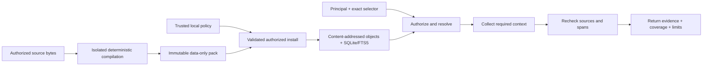

# Architecture and trust

StandardsForge is a local standards compiler and evidence engine. The standalone core owns source identities, package validation, deterministic retrieval, coverage accounting, and portable evidence. Host systems own project baselines, applicability, engineering decisions, and approvals.

## Data flow

Query paths do not download documents, execute pack content, call a model, or grant access from imported rights claims.

## Evidence layers

| Representation | What it establishes |
|---|---|
| `page_text` | Source-linked physical-page text extracted from a verified PDF text layer. |
| `derived_structure` | Automated exact-span navigation candidates plus unsupported regions. |
| `reviewed_structure` | Explicitly reviewed nodes and relationships bound to source spans. |
| `curated_records` | Curated records with their declared provenance and review state. |

Representations may coexist for one edition. A package digest pins one exact representation and byte inventory.

## Evidence versus judgment

StandardsForge preserves four different things:

1. exact source evidence;
2. derived records and classifications;
3. deterministic validation results;
4. human engineering decisions and approvals.

The first three cannot silently become the fourth. Retrieval does not decide applicability, tailoring, baseline selection, requirement approval, test adequacy, compliance, or certification.

## Authorization

Trusted local policy authorizes exact pack identities and content classes for a named principal. Pack-supplied rights metadata remains provenance only. Reads check current authorization before access and immediately before returning evidence. Revocation changes later results without rewriting immutable evidence.

## Integrity

Packs close their inventories, paths, sources, records, relationships, and digests. Retrieval rechecks exact source or sidecar bytes and declared spans. Required context is returned transitively; a response budget cannot silently drop required evidence while claiming completeness.

All untrusted PDF parsing runs in a disposable resource-limited worker. Parser failure, resource failure, and valid no-text pages are distinct outcomes.

## Rights

Public accessibility, processing permission, model-use permission, and redistribution permission are separate. The Apache-2.0 code license does not grant rights to third-party standards. Restricted content is outside the prepared public-source profile.

## Distribution channels

The prepared GitHub archive and PyPI serve different trust and rights boundaries:

- The prepared archive carries the qualified corpus, its acquisition and scope evidence, the exact bundled core wheel, and portable offline core setup. Its Windows x64 CPython 3.12 profile also carries a closed offline MCP wheelhouse.
- PyPI carries independently built StandardsForge code artifacts and optional dependencies only. It does not contain or fetch standards content. Linux and macOS MCP use this explicit networked code channel, then operate on the prepared distribution's local database and object store.

After installation, CLI and MCP query paths remain local and do not acquire documents or invoke a model.

## Current limits

- Physical page text is not document-wide visual fidelity.
- Automated outlines are not reviewed semantic clauses.
- OCR, table-cell interpretation, and figure interpretation are not generally established.
- Search is candidate discovery, not exhaustive applicability analysis.
- A local stdio MCP process is not a hosted multi-tenant service.
- Publisher currentness is not a project-approved baseline.

For normative implementation detail, read the [reference architecture](../ARCHITECTURE.md), [product baseline](../PRD.md), [decision index](../adr/README.md), and [security policy](../../SECURITY.md).
